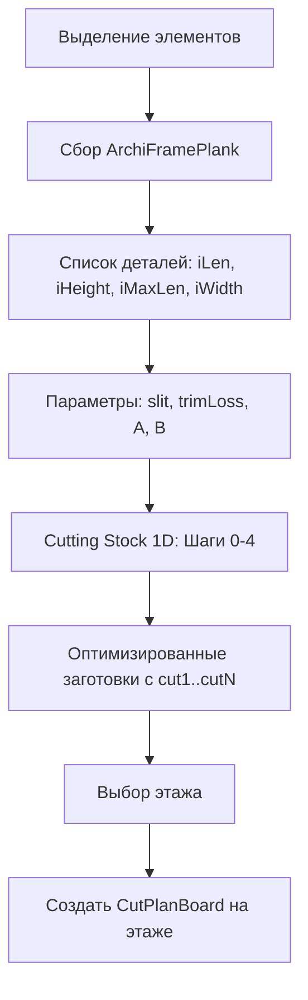

# План: План распила (Cutting Plan) — плагин + GDL

## Обзор

Плагин извлекает параметры из выделенных объектов **ArchiFramePlank.gsm** на плане или в 3D, собирает данные о пиломатериалах и создаёт на выбранном этаже чертежи плана распила (объект CutPlanBoard.gsm).

---

## 1. Источник параметров: ArchiFramePlank.gsm

**Один объект** из выделения служит эталоном — он должен быть экземпляром библиотечной части **ArchiFramePlank.gsm**.

### 1.1 Параметры GDL для извлечения

| Параметр | Назначение | Использование в плане распила |
|----------|------------|-------------------------------|
| **iHeight** | Ширина доски у каждого отрезка | boardW (ширина прямоугольника на чертеже) |
| **iLen** | Длина отрезка | cut1, cut2, … (длины сегментов распила) |
| **iMaxLen** | Максимальная длина заготовки (доски) | maxStockLength — база для раскладки, напр. 6000 мм |
| **iWidth** | Толщина доски | Группировка по материалам / спецификация |

### 1.2 Откуда берём объекты

- Выделение на **плане** (2D)
- Выделение в **3D** окне

Плагин работает с любым выделением, содержащим объекты ArchiFramePlank.

### 1.3 Параметры от пользователя (UI)

| Параметр | Описание | По умолчанию |
|----------|----------|--------------|
| **Толщина пилы (slit/kerf)** | Ширина пропила, мм | 4 |
| **trimLoss** | Обрезки по краям заготовки, мм | 0 |
| **A** | Порог «полезного» остатка (мм) — остаток ≥ A считается полезным | 300 |
| **B** | Порог «отхода» (мм) — остаток ≤ B считается отходом | 50 |
| **strictA_B** | Запрет остатков в зоне (B, A) | false |

---

## 2. Алгоритм оптимизации раскладки (Cutting Stock 1D)

**Задача** — классический Cutting Stock / Bin Packing 1D (NP-hard). Гибрид: *жадная упаковка + локальный поиск*.

### Шаг 0. Подготовка

1. **Группировка по материалам** (если включено): разбить детали по `iWidth` / material, решать каждую группу независимо.
2. **Развернуть детали поштучно** — каждый отрезок iLen как отдельная деталь (с возможностью агрегации в будущем).
3. **Фильтр невозможных**:
   - если `part.length + trimLoss > maxStockLength` → в `remaining_parts` (не помещаются, вывести отдельно).
   - проверять и с учётом slit (между деталями минимум один пропил).

### Шаг 1. Порядок деталей (Best-Fit Decreasing)

Сортировка по **убыванию длины**:
- основные ключ: `length DESC`
- тай-брейк: более «дефицитные» первыми (влезают только в немногие заготовки)
- затем: по material / имени для стабильности

### Шаг 2. Порядок заготовок

Список типов заготовок (если несколько iMaxLen), сортировка:
1. по **priority** (очередность выбора)
2. по длине (по возрастанию — чаще короткие, или режимом)

Заготовки открываются по мере надобности.

### Шаг 3. Размещение — Best Fit с оценкой остатка

Для каждой детали `p` по порядку:

1. Попытаться положить в **уже открытые** заготовки (где есть место).
2. Если не влезает — **открыть новую** заготовку, выбрав лучший тип.

**Проверка «влезает ли»:**
- `used` — текущая занятая длина в заготовке (начинается с trimLoss)
- при добавлении **первой** детали: `used += p.length` (без slit)
- при добавлении **следующих**: `used += slit + p.length` (slit — пропил между предыдущей деталью и новой)
- условие: `used <= maxStockLength`

**Функция оценки (score)** — меньше = лучше:

```
if remainder < 0: invalid
if strictA_B and (B < remainder < A): invalid

score = W1 * (will_open_new_stock ? 1 : 0)
      + W2 * remainder
      + W3 * (remainder <= B ? 1 : 0)   // штраф за отход
      + W4 * priorityPenalty
```

**Рекомендуемые веса:**
- `W1 = 1e9` — лишняя заготовка сильно хуже
- `W2 = 1`
- `W3 = 1000–10000` — отходы хуже полезного остатка
- `W4` — большой, если нужно строго соблюдать очередность заготовок

### Шаг 4. Локальное улучшение (Swap / Move / 2-opt / Repack)

После первичной раскладки:

| Операция | Описание |
|----------|----------|
| **Swap / Move** | Перенос одной детали из «плохой» заготовки в другую, если это уменьшает число заготовок, отход или переводит остаток из отхода в полезный |
| **2-opt** | Обмен парами деталей между двумя заготовками |
| **Repack** | Взять несколько худших заготовок (по отходу) и переупаковать их детали заново жадно |

**Ограничения** (чтобы не зависать):
- по времени: 100–500 мс на типовую задачу
- или по итерациям: ~2000 попыток

### Входные/выходные данные алгоритма

**Вход:**
- список деталей `{length, material?, ...}`
- `maxStockLength` (iMaxLen)
- `slit` (толщина пилы)
- `trimLoss`, `A`, `B`, `strictA_B`

**Выход:**
- массив заготовок, каждая: `{cuts: [cut1, cut2, ...], remainder, boardW, ...}`
- `remaining_parts` — не поместившиеся детали

---

## 3. Алгоритм плагина (общий поток)



---

## 4. Реализация по шагам

### 4.1 CuttingStockSolver (ядро алгоритма)

**CuttingStockSolver.hpp / .cpp** — независимый модуль, без ACAPI.

```cpp
struct Part { double length; GS::UniString material; };
struct SolverParams {
    double maxStockLength;  // iMaxLen
    double slit;            // толщина пилы, мм
    double trimLoss;
    double usefulMin;       // A
    double wasteMax;        // B
    bool strictAB;
    int maxImproveIter;     // ~2000
};
struct ResultBoard {
    GS::Array<double> cuts;  // cut1, cut2, ...
    double remainder;
    double boardW;           // iHeight
};
struct SolverResult {
    GS::Array<ResultBoard> boards;
    GS::Array<Part> remaining;
};
SolverResult Solve(const GS::Array<Part>& parts, const SolverParams& params);
```

Реализация: шаги 0–4 как в разделе 2.

### 4.2 CutPlanBoardHelper (интеграция с ArchiCAD)

**CutPlanBoardHelper.hpp / .cpp**

- `struct ArchiFramePlankParams` — iHeight, iLen, iMaxLen, iWidth, material?
- `bool IsArchiFramePlank(const API_Guid& guid)` — проверка по libInd + file_UName
- `bool GetArchiFramePlankParams(const API_Guid& guid, ArchiFramePlankParams& out)`
- `GS::Array<Part> CollectPartsFromSelection()` — сбор деталей (iLen→length, iHeight→boardW)
- `GSErrCode CreateCutPlanOnFloor(short floorInd, double slit, const SolverResult& result)` — создание CutPlanBoard на этаже

**Проверка «ArchiFramePlank.gsm»:**

```cpp
API_LibPart lp = {};
lp.index = element.object.libInd;
if (ACAPI_LibraryPart_Get(&lp) == NoError) {
    GS::UniString fname(lp.file_UName, APILibPartStrLen, CC_UC);
    if (fname.Contains("ArchiFramePlank") || fname == "ArchiFramePlank.gsm")
        return true;
}
```

**Извлечение AddPars** (аналог RandomizerHelper):

```cpp
ACAPI_Element_GetMemo(guid, &memo, APIMemoMask_AddPars);
// FindParameterByName(*memo.params, count, "iHeight", keywords, param);
// param->value.real → out.iHeight
```

### 4.3 Поиск библиотечной части CutPlanBoard

- Поиск объекта плана распила: `ACAPI_LibraryPart_Search` или `ACAPI::LM::LibraryManager::FindLibParts` по имени «CutPlanBoard» / «План распила».
- Либо включение CutPlanBoard.gsm в библиотеку плагина/проекта.

### 4.4 Создание объектов на этаже

```cpp
API_Element object = {};
object.header.type = API_ObjectID;
object.header.libInd = cutPlanBoardLibInd;  // из Search
object.header.floorInd = targetFloorInd;
object.object.pos = API_Coord{x, y};  // расстановка по порядку
// Fill memo.params: boardL, boardW, cut1..cut20, qtyVal, ...
ACAPI_Element_Create(&object, &memo);
```

### 4.5 UI — палитра «План распила»

- Кнопка в тулбаре (иконка «Распил» / «Cutting»).
- HTML-палитра:
  - **Параметры распила:** толщина пилы (slit), trimLoss, A, B, strictA_B.
  - **Выбор этажа** (список этажей).
  - **Таблица деталей:** объекты ArchiFramePlank из выделения (iLen, iHeight, iMaxLen).
  - Кнопка «Создать план распила».

### 4.6 Регистрация

- `ResourceIDs.hpp`: `CutPlanPaletteResId`, `CutPlanHtmlResId`, иконка.
- `Browser_Repl.grc` / `Browser_ReplFix.grc`: кнопка, палитра.
- `BrowserRepl.cpp`: обработчик кнопки, `RegisterACAPI` для JS (если используется палитра).
- `CMakeLists.txt`: CutPlanBoardHelper.cpp, CutPlanPalette.cpp.

---

## 5. Маппинг параметров ArchiFramePlank → CutPlanBoard

| Источник | CutPlanBoard |
|----------|--------------|
| Результат алгоритма (maxStockLength) | boardL |
| boardW из заготовки (iHeight) | boardW |
| Результат алгоритма (cuts[]) | cut1, cut2, … cut20 |
| Пользователь (slit) | kerfWidth |
| iWidth | material / спецификация |
| qtyVal | 1 на заготовку |

---

## 6. Порядок работ

1. [ ] **CuttingStockSolver** — реализовать алгоритм (шаги 0–4) без ACAPI.
2. [ ] **CutPlanBoardHelper** — сбор ArchiFramePlank, вызов Solver, создание CutPlanBoard.
3. [ ] Добавить CutPlanBoard.gsm в библиотеку (kerfWidth = slit из UI).
4. [ ] Палитра CutPlan + кнопка: slit, trimLoss, A, B, этаж, «Создать».
5. [ ] Тестирование: выделение → оптимизация → план на этаже.

---

## 7. Зависимости

- `RandomizerHelper` — образец работы с AddPars и FindParameterByName.
- `LandscapeHelper` — образец создания объектов, `floorInd`, `ACAPI_Element_Create`.
- `SelectionHelper` — образец работы с выделением.
